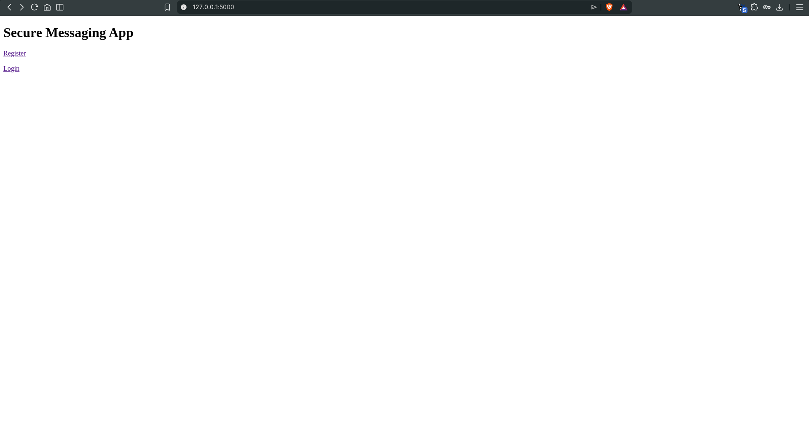
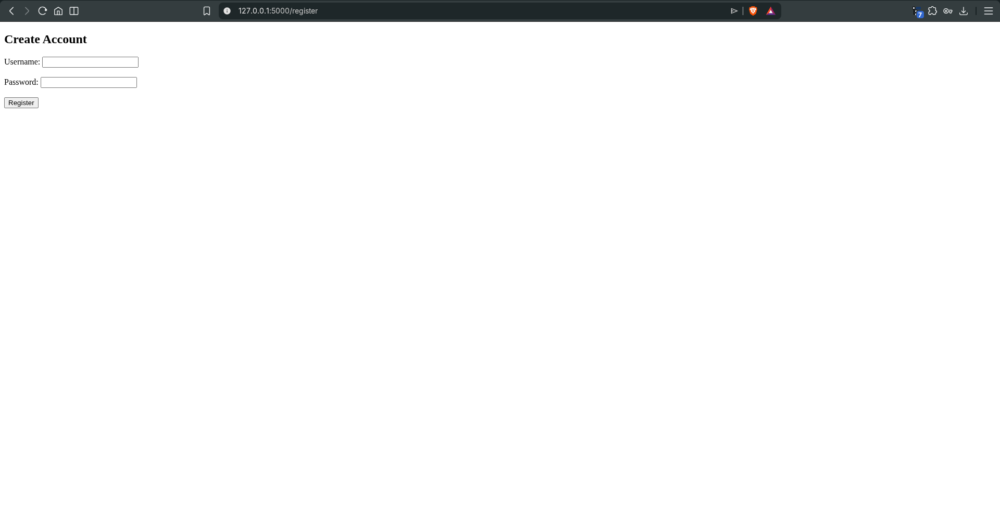
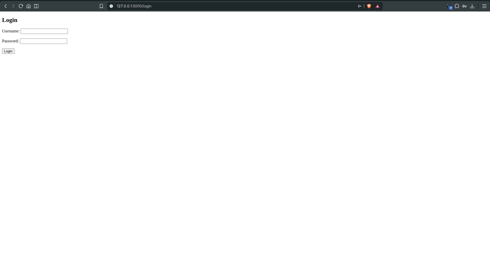
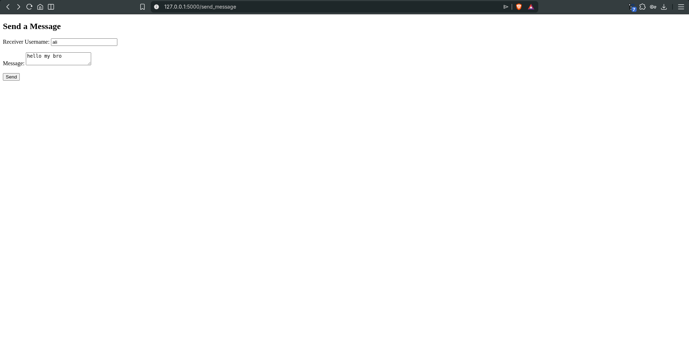
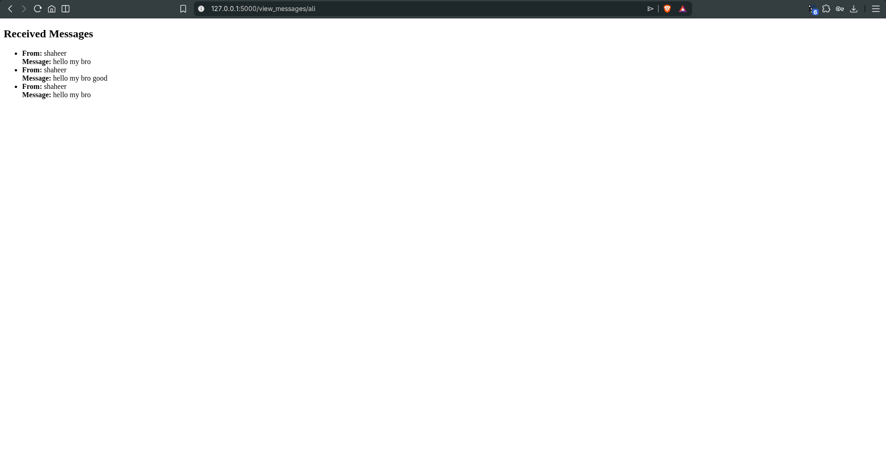

# Secure Messaging Application

## Project Overview
This project is a Secure Messaging Web Application built using Python and Flask.  
The application allows users to register, login, send encrypted messages, and view decrypted messages securely.

The system uses:
- RSA Encryption for securing messages
- bcrypt for password hashing
- SQLite database for storing users and messages

The goal of the project is to demonstrate secure communication between users using cryptography.

----------------------------------------------------

## Features

1. User Registration
Users can create an account with a username and password.
The password is hashed using bcrypt before storing it in the database.
When a user registers, the system automatically generates:
- RSA Public Key
- RSA Private Key

2. User Login
Users can login using their username and password.
The password is verified using bcrypt.

3. Send Secure Messages
Users can send messages to other registered users.
The message is encrypted using the receiver's public key before storing it in the database.

4. View Messages
When a user views their messages, the system decrypts them using the user's private key.

----------------------------------------------------

## Technologies Used

Python  
Flask  
SQLite  
bcrypt  
RSA Encryption  

----------------------------------------------------

## Project Structure

secure_messaging_app

demo.png
app.py  
database.db  
requirements.txt  

crypto/
rsa_utils.py

templates/
register.html  
login.html  
send_message.html  
view_messages.html  

venv/

----------------------------------------------------

## How To Run The Project

Step 1: Open the project folder in the terminal.

Step 2: Activate the virtual environment

Linux / Mac
source venv/bin/activate

Windows
venv\Scripts\activate

Step 3: Install the required libraries

pip install -r requirements.txt

Step 4: Run the application

python app.py

Step 5: Open the browser

http://127.0.0.1:5000

## Application Demo

### Home Page

---

### Register Page

---

### Login Page

---

### Send Message

---

### View Messages

----------------------------------------------------

## How To Use The Application

Register a user  
Go to:
/register

Create a username and password.

Login  
Go to:
/login

Send a message  
Go to:
/send_message

Enter:
Sender username  
Receiver username  
Message  

View messages  
Go to:
/view_messages/<username>

Example:
/view_messages/shaheer

----------------------------------------------------

## Security Implementation

Password Security
Passwords are hashed using bcrypt before storing them in the database.

Message Encryption
Messages are encrypted using RSA public key encryption.

Each user has:
Public Key (used to encrypt messages sent to them)  
Private Key (used to decrypt received messages)

----------------------------------------------------

## Demonstration Steps

1. Register two users
Example:
shaheer
doctor

2. Send a message from shaheer to doctor

3. Open the database and see that the message is encrypted

4. Open the page:
/view_messages/doctor

5. The message will appear decrypted.

----------------------------------------------------

## Conclusion

This project demonstrates how cryptography can be used to build a secure messaging system using Python and Flask.

It includes secure password storage, encrypted communication, and database integration.

----------------------------------------------------

## Author

Shaheer
Secure Messaging Application Project